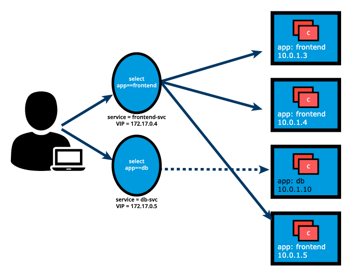

# Chapter 10 - Services

<b>Service</b> objects are used to abstract the communication between cluster internal microservices, or with the external world.

It offers a single DNS entry for a stateless containerized application managed by the cluster, regardless of the number of replicas.

It does this by providing a common load-balancing access point to a set of pods.

## Accessing Application Pods

Grouping of Pods is achieved via <b>Labels</b> and <b>Selectors</b>.

Here is an example of a frontend deployment:

```yaml
apiVersion: apps/v1
kind: Deployment
metadata:
  name: frontend
  labels:
    app: frontend
spec:
  replicas: 3
  selector:
    matchLabels:
      app: frontend
  template:
    metadata:
      labels:
        app: frontend
    spec:
      containers:
      - image: nginx:1.16-alpine
        name: nginx-application
        ports:
        - containerPort: 5000
```

Labels and Selectors use a key-value format.

We can create services that specify which label(s) they are servicing.

Here is an example service for a `ClusterIP` type of service. The `type` field is omitted in this manfiest, as `ClusterIP` is the default Service:

```yaml
apiVersion: v1
kind: Service
metadata:
  name: frontend-svc
spec:
  selector:
    app: frontend
  ports:
  - protocol: TCP
    port: 80
    targetPort: 5000
```

This can also be done directly:

```
$ kubectl expose deployment frontend --name=frontend-svc --port=80 --target-port=5000
```

By default, each Service receives an IP address routable only inside the cluster, known as a `ClusterIP`. In the below example, these are `172.17.0.4` and `172.17.0.5`:



A client can now connect to one of these Services via the ClusterIP, and it will be forwarded to a respective Pod with default Load Balancing.

The endpoints for a Service can be listed with:

```
$ kubectl get service,endpoints frontend-svc
$ kubectl get svc,ep frontend-svc
```