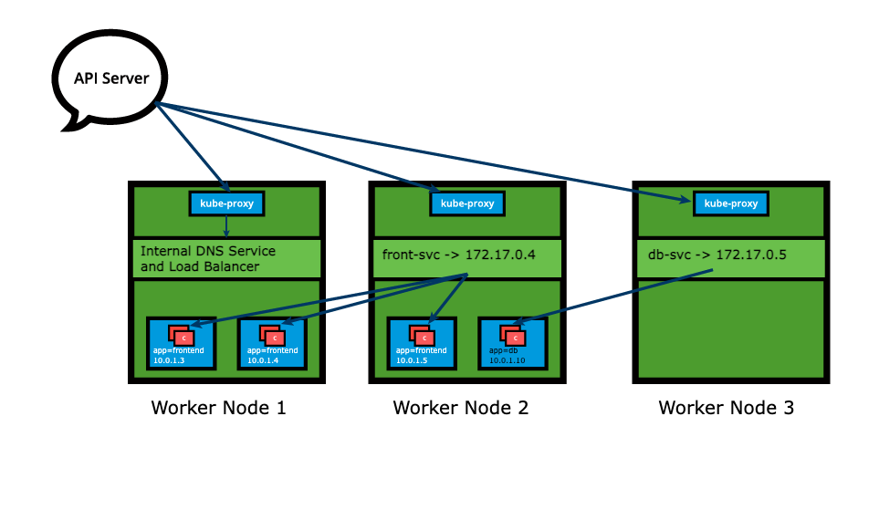

## kube-proxy

Each cluster node runs a daemon that watches the API server on the control plane for the addition, updates, and removal of Services and endpoints.

`kube-proxy` is responsible for implementing the Service config to enable traffic routing to an exposed application running in Pods.

This means any node can receive external traffic and route it internally in the cluster based on `kube-proxy`'s iptables rules.



## Traffic Policies

The Load-Balancing that Services performs with iptables rules is random by default.

If we desire better outcomes, we need to use <b>Traffic Policies</b>.

There are two options for TPs:

- Cluster
    - Allows `kube-proxy` to target all ready Endpoints of the Service (default)
- Local
    - Isolates load-balancing process to only include Endpoints of the Service on the same node as the requester Pod

These Traffic Policies can be configured separately for internal requests from other nodes, and for external requests:

```yaml
apiVersion: v1
kind: Service
metadata:
  name: frontend-svc
spec:
  selector:
    app: frontend
  ports:
  - protocol: TCP
    port: 80
    targetPort: 5000
  internalTrafficPolicy: Local
  externalTrafficPolicy: Local
```