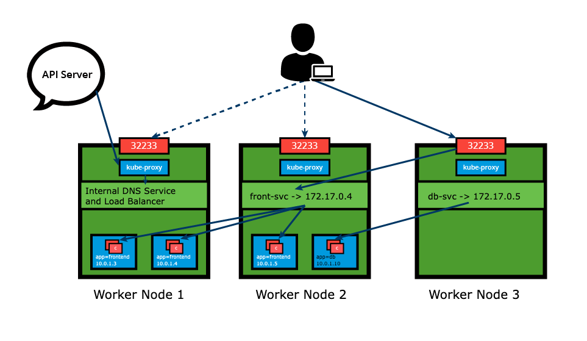

## Service Type

When defining a service, we can choose its access scope:

- Only accessible within the cluster
- Accessible from within cluster and external
- Maps to an entity which resides either inside or outside the cluster

This is defined by the `ServiceType` property.

### ClusterIP

`ClusterIP` is the default `ServiceType`.

The Service receives a ClusterIP, which is only accessible from within the cluster.

### NodePort

In addition to a ClusterIP, a high port, dynamically picked from the default range `30000`-`32767` is mapped to the respective service from all worker nodes.



We can also explicitly ask for a specific high port number.

This ServiceType is useful when we want to make our Services accessible from the external world.

The end-user connects to any worker node on the specified high port.

To manage access to multiple Services, admins can configure a _reverse proxy_, an ingress, and define rules that target specific Services within the cluster.

```yaml
apiVersion: v1
kind: Service
metadata:
  name: frontend-svc
spec:
  selector:
    app: frontend
  ports:
  - protocol: TCP
    port: 80
    targetPort: 5000
    nodePort: 32233
  type: NodePort
```

or

```
$ kubectl expose deployment frontend --name=frontend-svc --port=80 --target-port=5000 --type=NodePort
```

### All Together

1. Create a deployment:

```
$ kubectl create deployment deploy-hello --image=pbitty/hello-from:latest --port=80 --replicas=3
```

2. Expose the deployment

```
$ kubectl expose deployment deploy-hello --type=NodePort
```