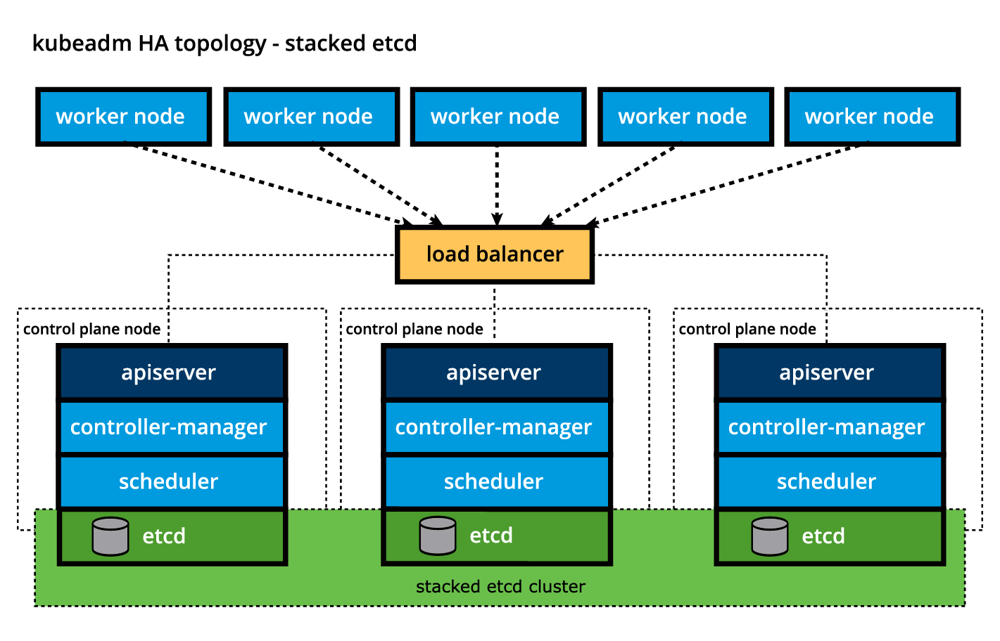
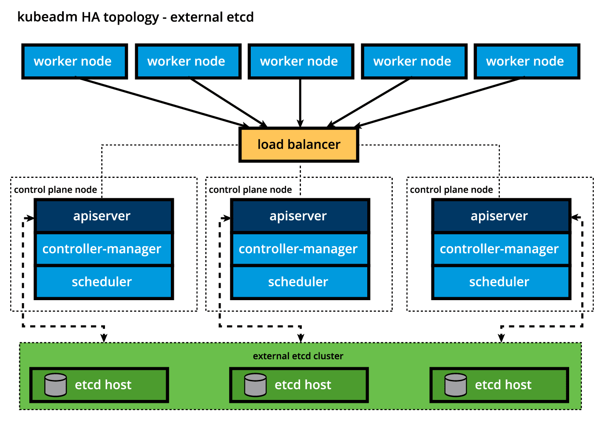
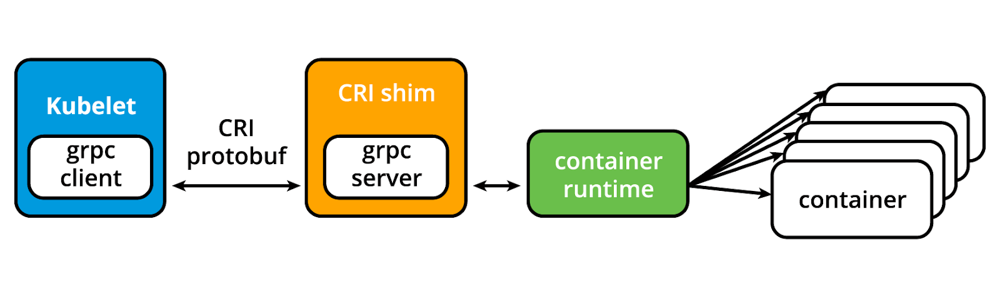

# Chapter 4 - Kubernetes Architecture

## Kubernetes Architecture

Kubernetes is a cluster of compute systems categorized by their distinct roles:

- One or more <b>control plane</b> nodes
- One or more <b>worker</b> nodes

## Control Plane Node Overview

The <b>control plane node</b> provides a running environment for the <b>control plane agents</b>.

The agents are responsible for managing the state of a Kubernetes cluster, and is the brain behind all operations inside the cluster.

### User Interaction

Users interact with the control plane by the following methods:

- CLI tool
- Web UI Dashboard
- API

### Control Plane Fault Tolerance

It is important to keep the control plane running at all costs.

Control plane node replicas can be added to the cluster, configured in <b>High-Availability</b> (HA) mode.

### Cluster State Persistence

All cluster config data is saved to a distributed key-value store which only holds cluster state related data.

No client workload generated data is stored here.

The key-value store may be configured:

- On the control plane node (_stacked topology_)
- On its dedicated host (_external topology_)

## Control Plane Node Components

The control plane runs the following essential components and agents:

- API Server
- Scheduler
- Controller Managers
- Key-Value Data Store

It also runs:

- Container Runtime
- Node Agent (_kubelet_)
- Proxy (_kube-proxy_)
- Optional observability addons such as:
    - Dashboards
    - Cluster-level monitoring
    - Logging

## Control Plane Node Components: API Server

All administrative tasks are coordinated by the <b>kube-apiserver</b>.

This API server intercepts RESTful calls from users, admins, devs, operators, and external agents.

Processing generally follows:
1. Read cluster's current state from key-value store
2. Execute call
3. Save resulting state to key-value store

The API server is the only component to talk to the key-value store.

## Control Plane Node Components: Scheduler

The role of the <b>kube-scheduler</b> is to assign new workload objects.

Decisions are made based on current cluster state and new workload requirements.

Scheduler asks API server for resource usage data from the key-value store.

Scheduler is highly customizable through scheduling policies, plugins, and profiles.

## Control Plane Node Components: Controller Managers

<b>Controller Managers</b> are components of the control plane running controllers or operator processes to regulate the state of the cluster.

They continuously compare the cluster's desired state with its current state.

The <b>kube-controller-manager</b> runs controllers or operators to act when nodes become unavailable.

The <b>cloud-controller-manager</b> interacts with underlying infrastructure of a cloud provider.

## Control Plane Node Components: Key-Value Data Store

<b>etcd</b> is its own open-source project under CNCF.

It is used to persist data in a cluster.

New data is always appended to the data store, never replacing old data.

Obsolete data is compacted periodically to minimize the size of the store.

<b>etcd</b> uses the CLI tool <b>etcdctl</b>.

This provides snapshot and restore capabilities.

Kubernetes bootstrapping tools, such as <b>kubeadm</b> provision stacked etcd control plane nodes, as shown below:

The bootstrapping process can also be configured to use an external etcd topology:

etcd is based on the <b>Raft Consensus Algorithm</b>:
- Allows collection of machines to work as a coherent group that can survive failures of its members.

Besides storing cluster state, etcd also stores config details such as:
- Subnets
- Config Maps
- Secrets
- etc.

## Worker Node Overview

<b>Worker Nodes</b> provide a running environment for client applications.

Kubernetes encapsulates these applications into <b>Pods</b>, controlled by the cluster control plane agents.

Pods are the smallest scheduling unit in Kubernetes.

<b>Pods</b> are collections of 1 or more containers scheduled together.

## Worker Node Components

- Container runtime
- Node agent - <b>kubelet</b>
- Proxy - <b>kube-proxy</b>
- Add-ons for DNS, observability, cluster-level monitoring and logging, and device plugins.

## Worker Node Components: Container Runtime

Kubernetes requires a <b>container runtime</b> on the node where a pod and its containers are to be scheduled.

Recommendation is to run the Kubernetes control plane components as containers.

Several runtimes are supported:
- CRI-O
    - Supports quay.io and DockerHub registries
- containerd
    - Simple, robust, and portable container runtime
- Docker Engine
    - Popular and complex container platform which uses containerd
- Mirantis Container Runtime
    - Formerly known as Docker Enterprise Edition

## Worker Node Components: Node Agent (kubelet)

The <b>kubelet</b> is an agent running on each node, control plane, and workers.

It communicates with the control plane.

It is the bridge between the API server and the container runtime of the node.

It also monitors health and resources of Pods running containers.

<b>kubelet</b> connects to container runtimes through the <b>Container Runtime Interface (CRI)</b>.

## Worker Node Components: kubelet - CRI shims

Any container runtime that implements the CRI could be used by Kubernetes to manage containers.

<b>Shims</b> are CRI implementations specific to each container runtime.

Some examples of shims include:

- <b>cri-containerd</b>
    - Allows direct control over containerd at kubelet's request
- <b>CRI-O</b>
    - Enables use of any Open Container Initiative (OCI), such as runC
- <b>dockershim</b> and <b>cri-dockerd</b>
    - <b>dockershim</b> is old implementation, no longer supported.
    - <b>cri-dockerd</b> is the CRI for the Docker Engine

## Worker Node Components: Proxy - kube-proxy

The network agent which runs on each node, control plane, and workers.

It is responsible for dynamic updates and maintenance of all networking rules on the node.

Implements forwarding rules defined by users through Service API objects.

Operates in conjunction with the <b>iptables</b> rules of the node.

## Worker Node Components: Add-ons

These are features not yet implemented in Kubernetes, so third-party does this:

- DNS
    - Cluster DNS assigns DNS records to Kubernetes objects and resources
- Dashboard
    - General purpose web-based user interface for cluster management
- Monitoring
    - Collects cluster-level information and saves them to central data store
- Logging
    - Collects cluster-level information and saves to central log store for analysis
- Device plugins
    - For system hardware resources, such as GPU or FPGA, to be advertised by node to application pods.

## Networking Challenges

Kubernetes needs to address the following networking challenges:

- Container-to-Container communication inside Pods
- Pod-to-Pod communication on same node and across cluster nodes
- Service-to-Pod communication within same namespace and across cluster namespaces
- External-to-Service communication for clients to access applications in cluster

### Communication Inside Pods

Container runtime creates an isolated network space for each container, called a <b>network namespace</b>.

When grouping containers in a Pod, a special infrastructure <b>Pause Container</b> is initialized by container runtime for sole purpose of creating a network namespace for the Pod.

This enables all containers inside a pod to talk via localhost.

## Communication Across Nodes

Each pod recieves a unique IP address (<b>IP-per-Pod</b>), which is on the same subnet.

Containers coordinate port assignments inside the pod.

Containers are integrated with the overall Kubernetes networking model through <b>Container Network Interface (CNI)</b>.

CNI is supported by <b>CNI Plugins</b>, which are mostly third-party:

- Flannel
- Weave
- Calico
- Cilium

## External-to-Pod Communication

Kubernetes enables external accessibility through <b>Services</b>.

These are complex encapsulations of network routing rule definitions stored in iptables on cluster nodes and implemented by <b>kube-proxy</b> agents.
