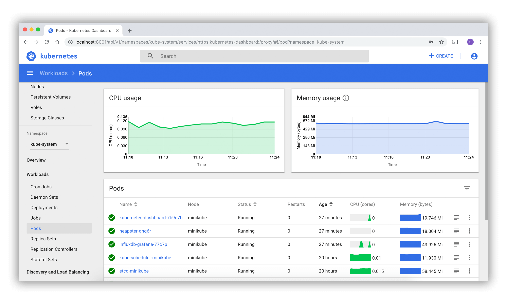

# Chapter 7 - Accessing Minikube

## Accessing Minikube

Minikube can be accessed via any one of the following methods:

- CLI tools and scripts (`kubectl`)
- Web-based UI dashboard
- API calls from CLI or programatically



## API Server

The API server is accessible through its endpoints by agents are users possessing the required credentials.


The API tree can be divided into three independent group types:

- Core Group (`/api/v1`)
    - Includes objects such as pods, services, nodes, namespaces, secrets, etc
- Named Group
    - Objects in `/apis/$NAME/$VERSION` format.
    - Different API version imply different levels of stability and support:
        - _Alpha_: May be dropped at any point without notice (`/apis/batch/v2alpha1`)
        - _Beta_: Well-tested, but semantics of objects may change in incompatible ways (`/apis/certificates.k8s.io/v1beta1`)
        - _Stable_: Appears in released software for many subsequent versions (`/apis/networking.k8s.io/v1`)
- System Wide
    - Consists of System-Wide API endpoints, like `/healthz`, `/logs`, `/metrics`, `/ui`, etc.

## kubectl

To access Minikube with `kubectl`, we may need to manually configure the cluster access points and certs required to securely access the cluster.

Verify the install:

```
$ kubectl version --client
Client Version: v1.30.0
Kustomize Version: v5.0.4-0.20230601165947-6ce0bf390ce3
```

## The kubectl Configuration File

To access a cluster, the `kubectl` client needs the control plane node endpoint and appropriate credentials to interact with the API server.

When starting Minikube, the startup process creates, by default, a config file `config` inside the `.kube` directory (often referred to as `kubeconfig`).

This resides in the user's `home` directory.

To read this file, it can either be read with `ls` or with:

```
$ kubectl config view
```

We can dump the cluster information for Minikube:

```
$ kubectl cluster-info
Kubernetes control plane is running at https://127.0.0.1:52720
CoreDNS is running at https://127.0.0.1:52720/api/v1/namespaces/kube-system/services/kube-dns:dns/proxy

To further debug and diagnose cluster problems, use 'kubectl cluster-info dump'.
```

## The Kubernetes Dashboard

Minikube installs the Dashboard as an addon, but it is disabled by default.

```
$ minikube addons list
minikube addons list
|-----------------------------|----------|--------------|--------------------------------|
|         ADDON NAME          | PROFILE  |    STATUS    |           MAINTAINER           |
|-----------------------------|----------|--------------|--------------------------------|
| ambassador                  | minikube | disabled     | 3rd party (Ambassador)         |
| auto-pause                  | minikube | disabled     | minikube                       |
| cloud-spanner               | minikube | disabled     | Google                         |
| csi-hostpath-driver         | minikube | disabled     | Kubernetes                     |
| dashboard                   | minikube | enabled ✅   | Kubernetes                     |
...

$ minikube addons enable metrics-server
🌟  The 'metrics-server' addon is enabled

$ minikube dashboard --url
```


## APIs with 'kubectl proxy'

Issuing the `kubectl proxy` command authenticates with the API server and makes services available on the default proxy port, `8001`.

```
$ kubectl proxy 
Starting to serve on 127.0.0.1:8001
```

We can now send requests to the API server over `localhost`:

```
StatusCode        : 200
StatusDescription : OK
Content           : {
                      "paths": [
                        "/.well-known/openid-configuration",
                        "/api",
                        "/api/v1",
                        "/apis",
                        "/apis/",
                        "/apis/admissionregistration.k8s.io",
                        "/apis/admissionregistration.k8s.io/v1",
                    ...
```

These endpoints can be explored in a browser as well.

## APIs with Authentication

When not using `kubectl proxy`, we need to authenticate to the API Server when sending API requests.

We do this by providing a <b>Bearer Token</b> when issuing a `curl` command, or by providing a set of <b>keys</b> or <b>certificates</b>.

The Bearer Token can be generated by the auth server at the client's request.

To create a token for the `default` ServiceAccount, and grant special permission to access the root of the directory of the API, we use the `clusterrole` Role Based Access Control (RBAC) policy:

```bash
$ export TOKEN=$(kubectl create token default)
```

or

```powershell
PS> $TOKEN = $(kubectl create token default)
```

for powershell.

```bash
$ kubectl create clusterrole api-access-root --verb=get --non-resource-url=/*
clusterrole.rbac.authorization.k8s.io/api-access-root created
```

Retrieve the API server endpoint:

```powershell
PS> kubectl config view

https://127.0.0.1:52720
PS> $APISERVER = 'https://127.0.0.1:52720'
```

Access the API Server using `curl`:

```powershell
PS> Invoke-RestMethod -Uri $APISERVER -Headers @{Authorization = "Bearer $TOKEN"} -SkipCertificateCheck
```

or

```bash
$ curl $APISERVER --header "Authorization: Bearer $TOKEN" --insecure
```