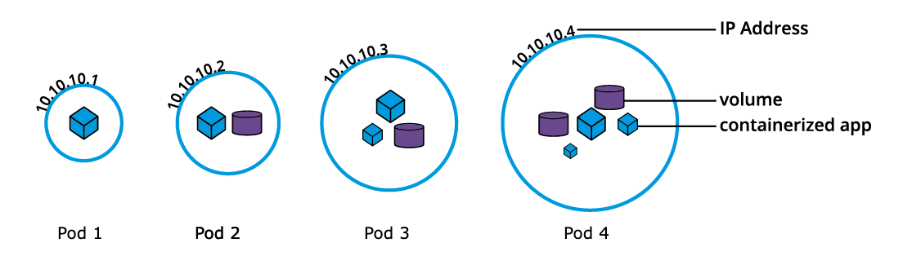

# Chapter 8 - Kubernetes Building Blocks

## Kubernetes Object Model

Kubernetes manages application lifecycle capabilities through a rich object model, representing different persistent entities in the cluster:

- What containerized applications are running
- The nodes where the containerized applications are deployed
- Application resource consumption
- Policies attached to applications, such as upgrade policies, fault tolerance, ingress/egress, access control, etc.

With each object, we declare the desired state in the `spec` solution.

Kubernetes manages the `status` section for objects, where it records the _actual_ state.

An object definition manifest must include other fields such as:

- The API version (`apiVersion`)
- The object type (`kind`)
- Additional helpful data (`metadata`)

In certain object definitions, `spec` is replaced by `data` and `stringData`.

Example of Kubernetes object types are:

- Nodes
- Namespaces
- Pods
- ReplicaSets
- Deployments
- DaemonSets
- etc.

The API request to create an object must have a `spec` section describing the desired state.

## Nodes

<b>Nodes</b> are virtual identities assigned by Kubernetes to the systems part of the cluster. These can be containers, VMs, bare-metal, etc.

Each node is managed with the help of the `kubelet` and the `kube-proxy`.

Based on their functions, there are two distinct types of nodes:

- Control Plane
- Worker

Node identities are assigned during the cluster bootstrapping process.

For example, Minikube uses `kubeadm` to initialize the control plane during the <b>init</b> phase and grow the cluster by adding worker nodes in the <b>join</b> phase.

## Namespaces

If multiple users and teams use the same cluster, it can be partitioned into virtual sub-clusters using <b>Namespaces</b>.

To list all namespaces:

```
$ kubectl get namespaces
```

Four namespaces are generally created out of the box:

- `kube-system`
    - Contains the objects created by the Kubernetes system, mostly the control plane agents
- `kube-public`
    - Unsecured and readable by anyone
    - Used for purposes such as exposing non-sensitive info about the cluster1
- `kube-node-lease`
    - Holds node lease objects used for node heartbeat data.
- `default`
    - Contains the objects and resources created by admins and devs
    - Objects are assigned to it by default unless another Namespace is provided by the user

Good practice is to create additional Namespaces as desired to virtualize the cluster and isolate users, dev teams, applications, or tiers:

```
$ kubectl create namespace <name>
```

## Pods

Pods are the smallest workload object, and the unit of deployment in Kubernetes. It represents a single instance of the application.

Containers in a pod are:

- Scheduled together on the same host with the pod
- Share the same network namespace, meaning they share a single IP address originally assigned to the pod
- Have access to mount the same external storage (volumes) and other dependencies



Pods cannot manage themselves, so controllers are used to handle management.

Controllers include:

- Deployments
- ReplicaSets
- DaemonSets
- Jobs
- etc.

An example of a stand-alone pod object's definition, without a controller:

```yaml
apiVersion: v1
kind: Pod
metadata:
    name: nginx-pod
    labels:
        run: nginx-pod
spec:
    containers:
    - name: nginx-pod
      image: nginx:1.22.1
      ports:
      - containerPort: 80
```

This pod creates a single container running the `nginx:1.22.1` image pulled from a container registry.

The pod's name and labels are used for workload accounting purposes.

This file can be saved as `def-pod.yaml` and loaded into a cluster with `create`:

```
$ kubectl create -f def-pod.yaml
```

We can also simply run the pod defined above without the manifest file:

```
$ kubectl run nginx-pod --image=nginx:1.22.1 --port=80
```

The manifest can be generated from an imperative command as such:

```
$ kubectl run nginx-pod --image=nginx:1.22.1 --port=80 --dry-run=client -o yaml > nginx-pod.yaml
```

They can also be applied in a hot state:

```
$ kubectl apply -f nginx-pod.yaml
```

More helpful pods commands:

```
$ kubectl get pods
$ kubectl get pod nginx-pod -o yaml
$ kubectl get pod nginx-pod -o json
$ kubectl describe pod nginx-pod
$ kubectl delete pod nginx-pod
$ kubectl replace --force -f nginx-pod.yaml
```

## Labels


